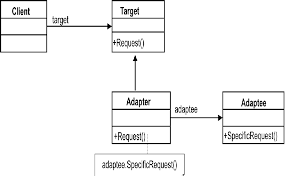
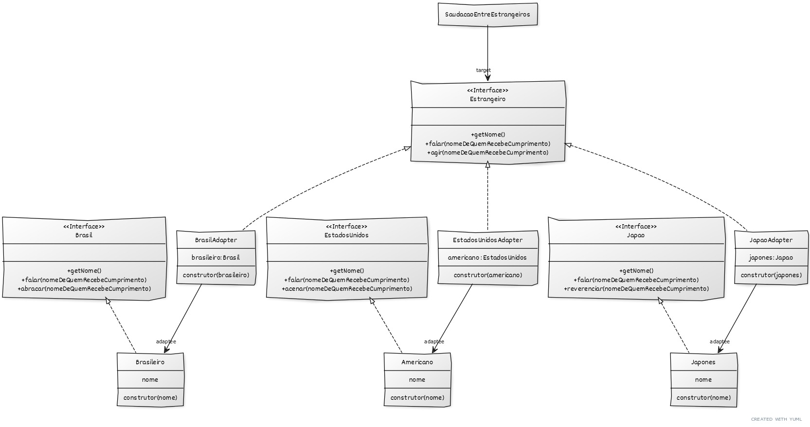

## Saudações entre estrangeiros - exemplo do Design Pattern Adapter
Neste exemplo, estrangeiros se cumprimentam fazendo um gesto particular da sua cultura e dizendo Olá na sua lingua característica.

O código comtempla as interfaces: Brasil.java, EstadosUnidos.java e Japao.java, assim como seus respectivos adaptees: Brasileiro.java, Americano.java e Japones.java.
Foram implementados 3 adapters, AmericanoAdapter, BrasileiroAdapter e JaponesAdapter tendo a interface Estrangeiro como target. 

Novos adapters podem ser implementados para enriquecer o modelo, sem que o target seja modificado, conforme a proposta do padrão Adapter.
## Acesso ao código e testes
Executar [SaudacaoEntreEstrangeiros](src/client/SaudacaoEntreEstrangeiros.java)
## Diagrama de Classes
Design Pattern: Adapter 

Saudação entre estrangeiros - Adapter

